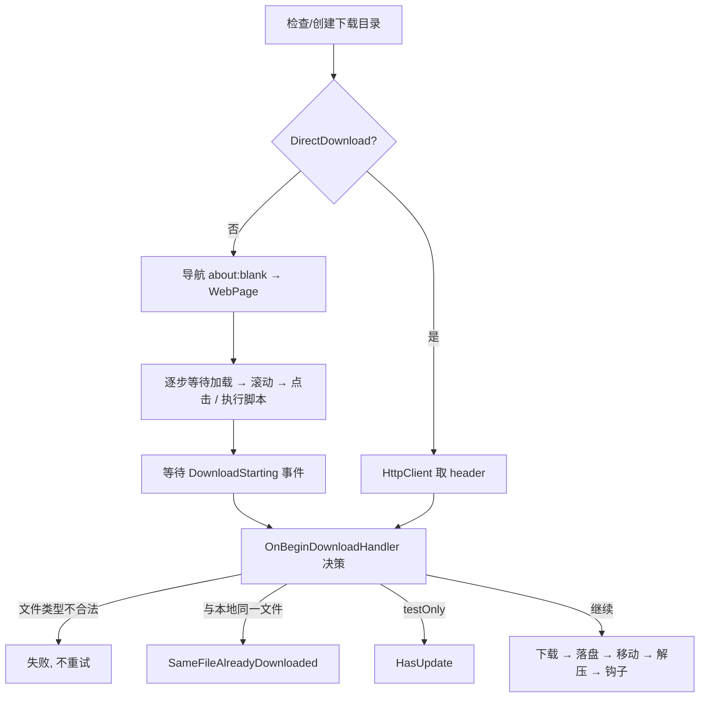

# SoftwareCrawler 设计与机制

面向后续维护者（含 AI agent）的工程说明。只讲**设计意图与运行机制**，不逐行解释实现；具体代码以文中给出的文件为准。
仓库约定、构建与调试流程见 [AGENTS.md](../AGENTS.md)，面向用户的安装说明见 [README.md](../README.md)。

## 1. 这个程序做什么

给定一份"软件清单"，每一项描述**怎么从官网页面走到下载链接**（XPath 点击序列或 JavaScript 片段），程序用内嵌的 WebView2 依次打开页面、执行这些步骤、拦截浏览器发起的下载，把安装包落到指定目录；文件没变就跳过，变了就替换、可选解压、可选执行钩子脚本。

两种使用形态：

- **交互式**：主窗口是一张可编辑的表格，一行一个软件，右键菜单可测试/下载/打开页面/编辑脚本。
- **无人值守**：`SoftwareCrawler.exe --download-all --auto-close`，`bin/AddDownloadEveryNight.cmd` 把它注册成每天 04:00 的计划任务。

技术栈：.NET 10 / WinForms / WebView2（Chromium），Windows 专用，非自包含发布（依赖桌面运行时）。

## 2. 解决方案结构

```
SoftwareCrawler.slnx
├── SoftwareCrawler/            WinForms 主程序
├── JeekTools.NET/              共享库（git submodule，多个应用复用）
├── Tools/DebugMcpBridge/       stdio MCP 桥接进程，仅开发期使用
└── Tests/SoftwareCrawler.Tests/ xunit 测试，覆盖不依赖 UI 的逻辑
```

测试跑 `dotnet test Tests/SoftwareCrawler.Tests/SoftwareCrawler.Tests.csproj`，CI 在发布前会执行。因为测试项目引用主程序，构建会写 `bin/SoftwareCrawler.exe`，**跑之前要先停掉本 worktree 正在运行的实例**。目前覆盖两块最经不起回归的纯逻辑：`.tab` 的读写与历史布局、设置的三方合并。`.tab` 往返测试是按 `DataProperties` 遍历写的，新增字段会自动纳入覆盖。

主程序内部分层（依赖方向自上而下）：

| 层 | 文件 | 职责 |
| --- | --- | --- |
| 入口 | `Program.cs` | 命令行解析、日志、watcher、MCP、启动主窗体 |
| UI | `MainForm.cs` / `SettingsForm.cs` / `SearchForm.cs` | 表格绑定、菜单动作、设置对话框、查找 |
| 领域 | `SoftwareItem.cs` | 一个软件的配方、序列化，以及绑定到表格的运行状态 |
| 领域 | `DownloadPipeline.cs` | 一次下载尝试的全过程；每次尝试新建一个实例 |
| 领域 | `SoftwareManager.cs` | 清单的加载/保存/合并/迁移 |
| 浏览器 | `BrowserObject.cs` | WebView2 封装，全局单例 `Browser` |
| 服务 | `Services/*` | 设置、配置监视、备份、自动更新、调试通道 |

`JeekTools.NET` 提供与业务无关的通用件：`SettingsStorage`（存储位置方案）、`JsonSettingsFile`（三方合并写入）、`SharedDataFile`（跨进程锁 + 原子写）、`LogManager`（ZLogger 封装）、`AutoUpdater`、`DebugMcpHost` + `ObjectGraph`（通用调试宿主）。**修改这些文件等于修改 submodule，会影响其它应用**。

两个 `global using static` 让单例随处可用，读代码时注意这些"凭空出现"的标识符：

- `Browser` → `BrowserObject.Browser`（`BrowserObject.cs:1`）
- `Settings` / `SettingsStore` → `SettingsSingletonContainer`（`Services/SettingsService.cs:1`）

## 3. 启动流程

`Program.Main`（`Program.cs:18`）顺序固定，后面的步骤依赖前面的结果：

1. 解析命令行：`--download-all` / `--auto-close` / `--force-close`。
2. 初始化日志（Debug 构建降到 `Debug` 级别）。
3. `ConfigChangeMonitor.Watch(活动 Config 目录, Debug 时额外监视 Templates 目录)`。
4. `DebugMcpServer.Start()` —— Release 构建里是空操作。
5. `Application.Run(new MainForm())`。

`MainForm.OnLoad`（`MainForm.cs:100`）里：创建一个**独立的宿主窗体**承载 WebView2（爬取时可见的浏览器窗口不是主窗口的一部分），`Browser.Init` 完成后 `Reload()` 读清单绑定表格，然后启动更新检查定时器。

`--download-all` 的执行时机在 `Application.Idle` 第一次触发时，且 `DownloadAll()` 内部会 `await _onLoadTaskCompletionSource.Task` 等浏览器就绪，因此不会与初始化竞态。

## 4. 爬取配方：SoftwareItem

一行清单就是一个 `SoftwareItem`。字段分成三组，**这个分组是整个配置体系的基础**：

- **`DataProperties`（配方，全机器共享，进版本库）**
  `Name` `WebPage` `XPathOrScript1..5` `Frames` `WaitSecondsBeforeClick` `StartDownloadTimeout` `FilePatternToDeleteBeforeDownload` `ExtractAfterDownload` `FilePatternToDeleteBeforeExtractionAndExtractOnly` `DirectDownload`
- **`ExtraProperties`（本机私有，不进版本库）**
  `Enabled` `DownloadDirectory` `DownloadDirectory2`
- **`[NonSerialized]` 运行时状态**：`Status` `Progress` `ErrorMessage`，通过 `INotifyPropertyChanged` 推给表格。setter 会检查当前 `SynchronizationContext`，必要时 `Post` 回 UI 线程，所以后台线程改状态是安全的。

关键语义：

- **XPath 还是脚本**：以 `//字母` 或 `(//字母` 开头视为 XPath（`DownloadPipeline.ClickAndTriggerDownload`），否则整段当 JavaScript 执行。
- **多步点击**：`XPathOrScript1..5` 按顺序执行，最后一步应触发下载。`Frames` 用反引号 `` ` `` 分隔，按下标与每一步对应，指定该步在哪个 iframe 里执行。
- **控制字符编码**：`.tab` 是制表符分隔的单行记录，换行以 `` `n ``、制表符以 `` `t `` 存储。属性里存的就是这个转义形式（表格显示的也是它），`GetXPathOrScripts()` / `SetXPathOrScripts()` 在编辑脚本时做还原与编码；`ToDataLine` 对**所有**字符串列再兜一次底，粘进单元格的制表符不会挪动后面的列。
- **`DirectDownload`**：跳过浏览器，直接用 `HttpClient` 拉 `WebPage`。为 SourceForge 这类"对自动化浏览器发 Cloudflare 挑战、对普通 HTTP 客户端放行"的站点准备；User-Agent 里保留 `Windows NT` 使 `latest/download` 之类链接解析到 Windows 版本。
- **`FinalDownloadDirectory`**：`DownloadDirectory` 为空时回退到 `Settings.DefaultDownloadDirectory`（再为空则系统下载目录）并追加以软件名命名的子目录。

## 5. 下载流水线

`SoftwareItem.Download()` 是重试外壳（含串行闸门），`DownloadPipeline.RunAsync()` 是一次完整尝试——每次尝试新建一个 `DownloadPipeline`，那一趟的中间状态（建议文件名、大小、时间戳、目标路径、暂存路径）就是它的字段。其结果只有三种：`Succeeded` / `FailedAndRetry` / `FailedAndNoRetry`。重试次数来自 `Settings.DownloadRetryCount`，间隔 `DownloadRetryInterval` 秒。**只有可能是瞬时故障的错误才标记重试**（点击失败、脚本失败、超时、HTTP 非 2xx、字节数不足）；目录创建失败、文件名不合法、复制失败一律不重试。



几个必须知道的决策规则（都在 `DownloadPipeline.OnBeginDownloadHandler`）：

- **文件类型白名单**：可执行 `.exe .msi .vsix .msix`、压缩包 `.zip .rar .7z`。其它一律判失败——这是"点错了链接、下到 HTML"的兜底。
- **"是不是同一个文件"**：优先比服务器给的大小；没有 `Content-Length` 时比服务器 `Last-Modified` 与本地文件修改时间（±2 秒）；两者都没有就当作需要下载。为让第二条成立，落盘后会用服务器时间戳回写文件的 `LastWriteTime`。
- **文件名会变的站点**（如 Epic Launcher）：靠 `FilePatternToDeleteBeforeDownload` 找到目录里的旧文件再比对。
- **旧版本清理的边界**：多个软件项共用一个下载目录是常规用法（7 个 JetBrains IDE 一个目录、每个 CUDA 版本一个目录），**靠模式本身区分彼此**——`FilePatternToDeleteBeforeDownload` 就是这个约定，程序不去猜别的项想要什么，各项之间也不产生关联。唯一的兜底是数量上限：单次匹配超过 10 个就整体放弃并记警告（`SelectOldVersions`），挡住把模式指向通用下载目录这类事故。在途的 `.partial` 永远不参与。
- **`testOnly`**：走完整个链路直到能判断"有没有更新"，随即取消下载，状态记为 `HasUpdate`。菜单里的 Test 和 MCP 的 `download_probe` 默认走这条路。

落盘顺序（`DownloadPipeline.Succeeded()`）：**直接下载到目标目录**，用 `<最终文件名>.partial` 作为在途名；完成后按 `FilePatternToDeleteBeforeDownload` 清理旧文件，再把 `.partial` 改名成最终文件（同卷改名是瞬时的，失败则退化为复制——WebView2 的安全扫描可能仍锁着文件）。若配置了 `DownloadDirectory2` 再复制一份。两个目录各自独立地执行解压与钩子。

在途文件就放在目标目录里，因此几处按模式扫描的地方都显式跳过 `.partial`：它既不能被当作"已下载的旧版本"参与判重，也不能被删除模式扫走。下载开始前会清掉上次中断留下的同名 `.partial`，否则浏览器会自动改名成 `xxx (1).partial`。

扩展点：目标目录下若存在 `AfterDownload.cmd`/`.ps1` 或 `AfterExtract.cmd`/`.ps1`，会以文件路径为参数同步调用（`.cmd` 优先）。解压用随程序附带的 `bin/7-Zip/7z.exe`，`e -r` 展平到根目录，之后删掉空子目录。

这两类外部进程都**不显示控制台窗口、检查退出码、失败时把输出记进日志**（`RunProcessAsync`）。失败即视为该项失败且不重试——文件已经在盘上，重下没有意义；状态停在 `Extracting` 或 `RunningEventScript`，错误信息里能看出是哪一步。7-Zip 的退出码 1 是非致命警告，按成功处理，2 及以上才算失败。

取消：`CancelDownload()` 置 `_hasCancelled` 并调 `Browser.Cancel()`；流水线中的等待循环都会检查这个标志。

## 6. 浏览器层（BrowserObject）

单例，包住一个 `WebView2`。设计上只暴露"爬取需要的动作"：`Load` / `TryClick` / `TryEvaluateJavascript` / `WaitForMainFrameLoadEnd` / `WaitForDownloaded` / `Cancel` / `ClearCookies` / `ShowDevTools`。

机制要点：

- **等待模型**：导航完成和下载完成各用一个 `TaskCompletionSource`，`PrepareLoadEvents()` 在每次动作前重建它们，`WithTimeout` 提供超时。所以"等待"永远不会跨动作串味。
- **启动参数**：关闭 SafeBrowsing 下载保护与下载气泡等 UI（`--safebrowsing-disable-download-protection` 等），否则自动下载会被拦。用户数据目录固定为**可执行文件目录**下的 `Cache`（不是当前工作目录——计划任务的 cwd 是 system32，那样会得到另一份 profile），代理来自设置。
- **弹窗**：`NewWindowRequested` 一律拦下，在当前窗口导航过去——爬取流程里不能出现第二个窗口。
- **取文件时间**：走 DevTools Protocol 订阅 `Network.responseReceived`，解析 `Last-Modified` 存进 `_lastRespondTime`，`DownloadStarting` 时作为 `DownloadItem.EndTime`。JSON 解析放到线程池，否则繁忙页面会把 UI 卡住。
- **下载拦截**：`DownloadStarting` 里设 `e.Handled = true` 抑制默认 UI，并把 `ResultFilePath` 改成流水线指定的路径；进度事件按 200ms 节流；文件名里的 ` (1)` 后缀会被去掉。
- **完成判定有两条路径**：`StateChanged == Completed`（正常路径，也是无 `Content-Length` 时唯一的路径）和"已收字节 == 总字节"（Edge 阻断状态变更时的兜底）。
- **iframe**：`FrameCreated` 时按名字登记 `CoreWebView2Frame`，脚本按 `Frames` 指定的名字投递到对应帧。

`DirectDownload` 分支复用了同一套 `DownloadItem` 与回调，因此**判重、进度、落盘逻辑对两种下载方式是同一份**。

## 7. 配置与数据存储

这是本工程最容易改错的部分，多数机制都是为了回答同一个问题：**用户的数据和仓库里的模板如何共存，且任何一方都不会被悄悄覆盖。**

### 7.1 两个文件，一份清单

| 文件 | 内容 | 版本控制 |
| --- | --- | --- |
| `Templates/Software.tab` | 爬取配方（`DataProperties`） | 入库，随发布包分发 |
| `Config/Software.tab` | 正式版实际读写的清单 | 不入库（首次运行从模板复制） |
| `Config/LocalSettings.tab` | 本机的 `Enabled` 与下载目录（`ExtraProperties`） | 不入库，**世上只有这一份** |

- **Debug 构建直接读写模板本身**（`SoftwareManager.cs:37`），所以开发时改配方即可提交；正式版永远不碰模板，升级只刷新模板，用户的 `Config/Software.tab` 不受影响（`SeedFromTemplate` 只在文件缺失时填补）。
- 两个文件**按 `Name` 关联**，不是按行号。因此增删行、拖动排序都不会让本机设置错位。

### 7.2 历史布局兼容

`SoftwareManager` 能读三种历史形态，读进来后按当前布局重写一次即完成迁移：

- `Software.tab` 首列是 `Enabled` 的旧布局（`LegacyDataProperties`）；
- `LocalSettings.tab` 有 `Name` 列但还没有 `Enabled` 列；
- 更早的、没有 `Name` 列、靠行号对齐的版本。

判定依据是表头首列（`IsLegacyDataHeader` / `ParseLocalSettings`），都容忍 BOM。另外 `FromDataLine` 允许列数少于属性数——旧版本写的文件缺少新增的尾列时，这些属性取默认值。

### 7.3 孤儿设置的保护

清单里没有、但 `LocalSettings.tab` 里有的行，会被记进 `_unclaimedLocalSettings` 并在保存时原样写回。理由：清单变短的原因往往是**临时性的**（另一半文件正被写、外部编辑中、误删了一行），而 `LocalSettings.tab` 没有版本库可回滚。真正要清掉它们得走菜单 **Clean up unused local settings**（或 MCP 的 `App.CleanUpLocalSettings()`），并且保存时会再次核对——期间"复活"的名字不会被写成两份。

### 7.4 写入的三道保险

1. **防抖**：`SoftwareManager.Save()` 合并 500ms 内的连续编辑；关窗和需要立刻落盘的地方调 `FlushAsync()` 绕过防抖。
2. **外部改动走合并**：`SaveCore` 写之前问 `ConfigChangeMonitor.HasExternalChange()`，发现文件在应用之外被改过，就重新读盘并把应用自己的改动折进去（`MergeWithDisk` → `ApplyLocalEdits`），而不是二选一丢掉一边。规则与 settings.json 的三方合并同构，以上次读写的内容为基准：应用没动过的行用磁盘上的值，动过的行用应用的值；应用增删的行同样生效，外部删掉的行不会复活。**顺序取磁盘的**——这是合并唯一保不住的东西，重新拖一下即可。合并失败才放弃保存。
3. **原子写 + 每日备份**：先写 `<name>.<pid>.<guid>.tmp` 再 `File.Move` 覆盖（`WriteLinesAtomic`）；写之前 `ConfigBackupService.BackupDaily` 把当天第一份原始内容复制到 `%LOCALAPPDATA%\SoftwareCrawler\Backups\yyyy-MM-dd\`，保留 30 天。备份**故意放在程序目录之外**——`bin/Config` 整体被 gitignore，放在旁边会被 `git clean -xfd` 一起清掉。

### 7.5 外部改动监视（ConfigChangeMonitor）

`FileSystemWatcher` 监视活动 Config 目录（Debug 时另加 `Templates`）。难点在于**区分"别人改的"和"自己写的"**：

- 每次应用读或写完文件，用 `MarkSelfWrite` 记下内容的 SHA256 **和写入开始时刻**。
- 事件先攒批：安静 10 秒才上报，最长 30 秒强制上报；`.tmp` 事件直接丢弃。
- 上报前逐个判定：哈希不同 → 外部改动；哈希相同但**事件时间早于本次写入开始时间** → 说明别人先改过、随后被应用覆盖了，同样上报（`IsExternalChange`，`ConfigChangeMonitor.cs:301`）。

上报后 `MainForm.OnConfigChanged` 按文件名分派：`settings.json` → 重载 roaming 设置并重新应用主题；`Software.tab` / `LocalSettings.tab` → `Reload()` 重新绑定表格。

## 8. 设置体系

设置按**是否该跟人走**拆成两半（`Models/AppSettings.cs`）：

- `MachineAppSettings`：`StorageLocation` `CustomStoragePath` `Proxy` `ExternalJavascriptEditor` `DefaultDownloadDirectory`。永远存在 `%LOCALAPPDATA%\SoftwareCrawler\Config\settings.json`。
- `RoamingAppSettings`：各类超时/重试次数、主题、更新检查频率。存在**活动 Config 目录**的 `settings.json` 里，和软件清单同进退。
- `AppSettings` 是两者合并后的扁平视图，应用代码只用它。它**不持有值**，每个属性转发到 `Machine` 或 `Roaming` 对象，因此没有"合并/拆分/拷回"这类需要人工同步的映射代码；`SettingsService` 只负责加载、归一化（`Math.Clamp` 各种超时）和写回。加一个设置项 = 往两个存储类之一加属性 + 在扁平视图上加一行转发，漏了第二步会在调用点编译失败，而测试 `EveryStoredSettingIsReachableFromTheFlatView` 会直接指出来。扁平形状同时也是拆分前那版 `Settings.json` 的形状，所以老文件反序列化进来就自动落到各自的一半里。

**存储位置**三选一（`StorageLocation`）：AppData（默认）/ 便携（可执行文件旁的 `Config`）/ 自定义目录。判定规则是：**只要可执行文件旁存在 `Config` 目录，就强制便携模式**，与保存的值无关。仓库里 `bin/Config/.gitkeep` 就是为此存在——每个 worktree 自带 `Config`，于是各自便携、互不干扰，不会共用一份 AppData 配置。设置窗口切换位置时会询问是否搬迁 `Config` 目录（`SettingsForm.cs:166` 起）。

写入用 `JsonSettingsFile.TryMergeAndWrite` 做**三方合并**：以上次保存的快照为 baseline，只有"本次真正改动过的键"才覆盖盘上的值。这样多个实例并发保存不会互相抹掉。另有一次性迁移：旧版本放在可执行文件旁的单文件 `Settings.json` 会被读入、拆分写出、然后删除。

## 9. UI 层要点

- 表格是 `DataGridView` + `BindingList<SoftwareItem>`，列由属性自动生成（`[Browsable(false)]` 的 `FinalDownloadDirectory` 因此不显示）。所有增删/排序都直接操作 `BindingList` 然后 `Save()`。
- 下载期间用 `DownloadUIDisabler`（`IDisposable`）统一禁用菜单、启用取消项，`using` 作用域结束自动恢复。
- 下载是**串行**的：全局只有一个浏览器和一组下载回调，两个下载同时跑会互相应答对方的事件。菜单本来就逐项 await，`SoftwareItem.Download()` 里的信号量（`DownloadGate`）负责挡住从别处发起的下载——调试工具、第二个菜单动作——不与之重叠。
- 表格的重新绑定由 `SoftwareManager.Reloaded` 事件驱动，而不是写在某个菜单处理器里：`Load()` 是把 `Items` 清空重填，绑定它的 `BindingList` 收不到任何通知，所以**任何**路径触发的重载都必须重新绑定，包括不经过 UI 的调试入口。
- 反射性能敏感处都做了退让：列宽只按 `DisplayedCells` 测量、查找放到线程池并防抖 150ms、高亮只重画变化的行。
- **外部编辑脚本**：右键 Edit script 会把 1..5 步脚本用 `\n// ``\n` 拼成一个 `.js` 临时文件，交给 `ExternalJavascriptEditor`（缺省 notepad）打开，确认后再按分隔符拆回去。这是编写爬取脚本的主要工作流。

## 10. 调试通道：Debug MCP

用途：让 AI agent（或人）在程序**运行时**读写对象、看控件树、截图、跑单项爬取。

```
Claude Code ──stdio──> Tools/DebugMcpBridge ──HTTP JSON-RPC──> 运行中的 Debug 实例
                              ↑ 读 bin/debug-mcp.json 定位
```

- **只有 Debug 构建监听**（`DebugMcpServer.ListeningEnabled`），但代码在所有配置下都编译，避免 `#if DEBUG` 造成两套行为。
- 监听 `127.0.0.1`，默认端口 8747 起向上扫描，`SC_MCP_PORT` 可指定；端口用全局 `Mutex` 预定，多个 worktree 并行时自动错开。
- 启动后写 `bin/debug-mcp.json`（URL、pid、可执行路径、instance id、worktree 根、Config 根）。桥接进程会**校验 workspace 是否是自己那一个、进程是否还活着、可执行路径是否吻合**，三者任一不符就明确报错，杜绝"连到隔壁 worktree"。
- 实例身份由 `DebugInstanceContext` 计算：可执行目录哈希取前 12 位作 InstanceId，再从 `.git`（支持 worktree 的 `gitdir:` 标记）读分支与短 commit，拼成窗口标题后缀，肉眼即可分辨多开实例。
- 工具清单集中在 `DebugMcpContract.BuildToolList()`——**放在应用侧，桥接进程未启动应用时也能回答 `tools/list`**。通用工具 `describe` `get_value` `set_value` `invoke` `list_members` `read_logs` 来自 `DebugMcpHost` + `ObjectGraph`；应用工具为 `control_tree` `screenshot` `software_list` `download_probe` `storage_info` `config_monitor`。
- 对象路径根：`App`（聚合入口，还挂着 `FlushSoftwareList` / `ReloadSoftwareList` / `BackupConfigNow` / `CleanUpLocalSettings` 等动作）、`MainForm`、`Settings`、`SettingsStore`、`Browser`、`Software`。`#Name` 按名字深搜控件。
- 所有工具在 UI 线程上执行，带 15 秒超时；`download_probe` 特意只在 UI 线程上**启动**下载，随后在池线程 await，避免死锁。

**新增功能后，把可供验证的入口加进这套工具**是本仓库的既定规则（见 AGENTS.md）。

## 11. 日志、更新与发布

- **日志**：ZLogger 滚动文件，写在可执行目录的 `Logs/`，保留 7 天，`SoftwareCrawler.log` 是指向当前文件的硬链接别名。Debug 构建记到 `Debug` 级别。
- **版本号**：CI 用 `git rev-list --count HEAD` 作为主版本号（`123.0.0.0`），同时写出 `version.txt`。本地构建恒为 `0.0.0.0`，UI 显示 `dev build`。
- **自动更新**：`AutoUpdateService` 包装 JeekTools 的 `AutoUpdater`，从固定 tag `latest_release` 拉 `version.txt` 比对，下载 `SoftwareCrawler.zip` 到暂存目录，再启动 `bin/AutoUpdate.ps1` 完成"等进程退出 → 换文件 → 重启"。**Debug 构建禁用更新**；启动时检查一次，之后按 `UpdateCheckFrequency` 定时。
- **发布**：`.github/workflows/build-and-release.yml` 在 push main 时发布，删除并重建 `latest_release` tag，上传 zip 与 version.txt。本地对应 `Publish.cmd`（ReadyToRun + NetBeauty，输出到 `bin`）。
- **安装**：`install.ps1` 装到 `%LOCALAPPDATA%\Programs\SoftwareCrawler`，建开始菜单快捷方式，缺运行时则调 `bin/Setup.cmd`（内含提权 + `dotnet-install.ps1`）。全程不写注册表。

## 12. 关键不变式

改动时优先保住这些性质，它们各自对应过一次真实的故障：

1. **`Templates/Software.tab` 只装配方**；任何"这台机器的选择"都属于 `LocalSettings.tab`。往 `DataProperties` 里加本机相关字段会污染所有用户的版本库。
2. **两个 `.tab` 靠 `Name` 关联**，不得退回按行号对齐。
3. **不要覆盖被外部改过的配置文件**；宁可放弃本次保存，也不要吞掉用户在编辑器里的修改。
4. **`LocalSettings.tab` 无版本控制**：任何会重写它的改动都要先想清楚失败时怎么恢复（每日备份是最后一道防线）。测试涉及它时先备份。
5. **`bin/Config/` 必须存在**（靠 `.gitkeep`），它是便携模式的开关，也是多 worktree 互不干扰的前提。
6. **运行时文件直接在 `bin/` 下版本控制**，不要从源码目录复制过去（`bin/Templates`、`bin/7-Zip`、各 `.cmd`/`.ps1`）。
7. **下载判重依赖落盘时回写的文件时间戳**，改动落盘逻辑时别把 `SetLastWriteTime` 去掉。
8. **调试通道只应在 Debug 下监听**，且只连当前 worktree 的实例。

## 13. 常见改动的落点

| 想做的事 | 要动的地方 |
| --- | --- |
| 给配方加一个字段 | `SoftwareItem` 属性 + `DataProperties`；旧文件靠"列数可少于属性数"自动兼容，无需迁移代码 |
| 加一个本机私有字段 | `SoftwareItem` 属性 + `ExtraProperties`；同时确认 `LegacyExtraProperties` 的读取路径仍成立 |
| 加一个设置项 | `MachineAppSettings` 或 `RoamingAppSettings` 二选一 + `AppSettings` 加一行转发（+ 需要范围限制就写进 `Normalize*`）→ `SettingsForm` 加控件 |
| 支持一种新的下载方式 | 在 `DownloadPipeline` 里复用 `OnBeginDownloadHandler` / `Succeeded` 这条决策与落盘链路（`DirectDownload` 就是这么接的） |
| 加一个调试能力 | `DebugMcpServer.CreateHost()` 注册工具 + `DebugMcpContract.BuildToolList()` 声明 schema；简单读写优先挂到 `AppRoot` 上，用 `get_value`/`invoke` 直接触达 |
| 排查"配置被覆盖/没保存" | MCP `config_monitor`：watcher 是否存活、pending 事件、每个文件的基线哈希与 `externallyChanged`、备份清单 |
