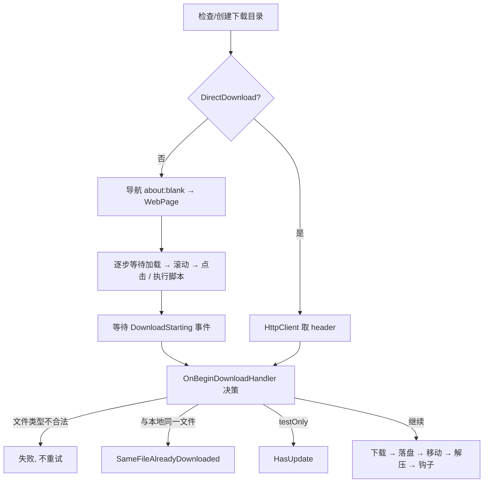

# SoftwareCrawler 设计与机制

面向后续维护者（含 AI agent）的工程说明。只讲**设计意图与运行机制**，不逐行解释实现；具体代码以文中给出的文件为准。
仓库约定、构建与调试流程见 [AGENTS.md](../AGENTS.md)，面向用户的安装说明见 [README.md](../README.md)。

## 1. 这个程序做什么

给定一份"软件清单"，每一项描述**怎么从官网页面走到下载链接**（XPath 点击序列或 JavaScript 片段），程序用内嵌的 WebView2 依次打开页面、执行这些步骤、拦截浏览器发起的下载，把安装包落到指定目录；文件没变就跳过，变了就替换、可选解压、可选执行钩子脚本。

两种使用形态：

- **交互式**：主窗口是一张可编辑的表格，一行一个软件，右键菜单可测试/下载/打开页面/编辑脚本。
- **无人值守**：`SoftwareCrawler.exe --download-all --auto-close`，`bin/AddDownloadEveryNight.cmd` 把它注册成每天 04:00 的计划任务。

技术栈：.NET 10 / WinForms / WebView2（Chromium），Windows 专用，非自包含发布（依赖桌面运行时）。

## 2. 解决方案结构

```
SoftwareCrawler.slnx
├── SoftwareCrawler/            WinForms 主程序
├── JeekTools.NET/              共享库（git submodule，多个应用复用）
├── Tools/SoftwareCrawlerMcp/   stdio MCP 适配器，发布到 bin/SoftwareCrawlerMcp.exe，仅开发期使用
└── Tests/SoftwareCrawler.Tests/ xunit 测试，覆盖不依赖 UI 的逻辑
```

测试跑 `dotnet test Tests/SoftwareCrawler.Tests/SoftwareCrawler.Tests.csproj`，CI 在发布前会执行。因为测试项目引用主程序，构建会写 `bin/SoftwareCrawler.exe`，**跑之前要先停掉本 worktree 正在运行的实例**。目前覆盖两块最经不起回归的纯逻辑：`.tab` 的读写与设置的三方合并。`.tab` 往返测试是按 `DataProperties` 遍历写的，新增字段会自动纳入覆盖。

主程序内部分层（依赖方向自上而下）：

| 层 | 文件 | 职责 |
| --- | --- | --- |
| 入口 | `Program.cs` | 命令行解析、日志、watcher、MCP、启动主窗体 |
| UI | `MainForm.cs` / `SettingsForm.cs` / `SearchForm.cs` | 表格绑定、菜单动作、设置对话框、查找 |
| 领域 | `SoftwareItem.cs` | 一个软件的配方、序列化，以及绑定到表格的运行状态 |
| 领域 | `DownloadBatch.cs` | 一批条目的顺序、重置、取消标志；不认识窗体 |
| 领域 | `ScriptEditSession.cs` | 脚本在临时 `.js` 文件与 1..5 槽之间的往返 |
| 领域 | `DownloadPipeline.cs` | 一次下载尝试的全过程；每次尝试新建一个实例 |
| 领域 | `SoftwareManager.cs` | 清单的加载/保存/合并/迁移 |
| 浏览器 | `BrowserObject.cs` | WebView2 封装，全局单例 `Browser` |
| 服务 | `Services/*` | 设置、配置监视、备份、自动更新、调试通道 |

`JeekTools.NET` 提供与业务无关的通用件：`SettingsStorage`（存储位置方案）、`JsonSettingsFile`（三方合并写入）、`SharedDataFile`（跨进程锁 + 原子写）、`LogManager`（ZLogger 封装）、`AutoUpdater`、`McpHost` + `McpPipeServer` + `ObjectGraph`（通用 MCP 宿主与命名管道传输）。**修改这些文件等于修改 submodule，会影响其它应用**。

两个 `global using static` 让单例随处可用，读代码时注意这些"凭空出现"的标识符：

- `Browser` → `BrowserObject.Browser`（`BrowserObject.cs:1`）
- `Settings` / `SettingsStore` → `SettingsSingletonContainer`（`Services/SettingsService.cs:1`）

## 3. 启动流程

`Program.Main`（`Program.cs:18`）顺序固定，后面的步骤依赖前面的结果：

1. 解析命令行：`--download-all` / `--auto-close` / `--force-close`。
2. 初始化日志（Debug 构建降到 `Debug` 级别）。
3. `SingleInstanceGuard.Acquire()` —— 同一可执行目录只允许一个实例，抢不到就记一行日志退出。
4. `ConfigChangeMonitor.Watch(活动 Config 目录, Debug 时额外监视 Templates 目录)`。
5. `DebugMcpServer.Start()` —— Release 构建里是空操作。
6. `Application.Run(new MainForm())`。

**单实例**：同目录的两个实例共用 `Cache` 这一份 WebView2 profile，而 profile 认启动参数——别的进程用不同 `--proxy-server` 占着时，需要代理的条目连浏览器都建不起来（`0x8007139F`），夜里那批走代理的条目会全军覆没，不走代理的却毫发无损。占位用的是 `Cache\instance.lock`（`FileOptions.DeleteOnClose` 独占打开，内容是 pid）而不是互斥体：文件锁跨得过桌面会话与计划任务会话的边界，不需要 `Global\` 内核对象那份权限，进程一死锁就没了。交互式启动被挡下时会把已在跑的那个窗口提到前台，`--download-all` 则安静退出——4 点钟弹个对话框会把计划任务永远挂在那儿。不同 worktree 各有各的 `bin`，互不影响。

`MainForm.OnLoad`（`MainForm.cs:100`）里：创建一个**独立的宿主窗体**承载 WebView2（爬取时可见的浏览器窗口不是主窗口的一部分），`Browser.Init` 完成后 `Reload()` 读清单绑定表格，然后启动更新检查定时器。

`--download-all` 的执行时机在 `Application.Idle` 第一次触发时，且 `DownloadAll()` 内部会 `await _onLoadTaskCompletionSource.Task` 等浏览器就绪，因此不会与初始化竞态。

## 4. 爬取配方：SoftwareItem

一行清单就是一个 `SoftwareItem`。字段分成三组，**这个分组是整个配置体系的基础**：

- **`DataProperties`（配方，全机器共享，进版本库）**
  `Name` `WebPage` `DirectDownload` `XPathOrScript1..5` `Frames` `WaitSecondsBeforeClick` `StartDownloadTimeout` `FilePatternToDeleteBeforeDownload` `FilePatternToDeleteBeforeExtraction` `ExtractAfterDownload` `ExtractToRoot`
- **`ExtraProperties`（本机私有，不进版本库）**
  `Enabled` `DownloadDirectory` `DownloadDirectory2` `UseProxy`
- **`[NonSerialized]` 运行时状态**：`Status` `Progress` `ErrorMessage`，通过 `INotifyPropertyChanged` 推给表格。setter 会检查当前 `SynchronizationContext`，必要时 `Post` 回 UI 线程，所以后台线程改状态是安全的。

关键语义：

- **XPath 还是脚本**：以 `//字母` 或 `(//字母` 开头视为 XPath（`DownloadPipeline.ClickAndTriggerDownload`），否则整段当 JavaScript 执行。
- **多步点击**：`XPathOrScript1..5` 按顺序执行，最后一步应触发下载。`Frames` 用反引号 `` ` `` 分隔，按下标与每一步对应，指定该步在哪个 iframe 里执行。
- **控制字符编码**：`.tab` 是制表符分隔的单行记录，换行以 `` `n ``、制表符以 `` `t `` 存储。属性里存的就是这个转义形式（表格显示的也是它），`GetXPathOrScripts()` / `SetXPathOrScripts()` 在编辑脚本时做还原与编码；`ToDataLine` 对**所有**字符串列再兜一次底，粘进单元格的制表符不会挪动后面的列。
- **`DirectDownload`**：跳过浏览器，直接用 `HttpClient` 拉 `WebPage`。为 SourceForge 这类"对自动化浏览器发 Cloudflare 挑战、对普通 HTTP 客户端放行"的站点准备；User-Agent 里保留 `Windows NT` 使 `latest/download` 之类链接解析到 Windows 版本。
- **`FinalDownloadDirectory`**：`DownloadDirectory` 为空时回退到 `Settings.DefaultDownloadDirectory`（再为空则系统下载目录）并追加以软件名命名的子目录。

## 5. 下载流水线

三层各管一件事：`DownloadBatch.RunAsync()` 管一批（顺序、开跑前统一 `ResetStatus`、取消标志），`SoftwareItem.Download()` 是重试外壳（含串行闸门），`DownloadPipeline.RunAsync()` 是一次完整尝试。

`DownloadBatch` 由 `MainForm.DownloadBatch` 持有，但不引用任何 UI 类型——菜单、快捷键和调试工具驱动的是同一个实例，所以取消能落到当前那一项上，无论是谁起的头。窗体只补它独有的两件事（`RunBatchAsync`）：等 `OnLoad` 把浏览器建好，以及运行期间锁住菜单项。测试注入自己的下载委托，因此批量的顺序与取消语义能脱离浏览器验证（`Tests/SoftwareCrawler.Tests/DownloadBatchTests.cs`）。

`SoftwareItem.Download()` 是重试外壳（含串行闸门），`DownloadPipeline.RunAsync()` 是一次完整尝试——每次尝试新建一个 `DownloadPipeline`，那一趟的中间状态（建议文件名、大小、时间戳、目标路径、暂存路径）就是它的字段。其结果只有三种：`Succeeded` / `FailedAndRetry` / `FailedAndNoRetry`。重试次数来自 `Settings.DownloadRetryCount`，间隔 `DownloadRetryInterval` 秒。**只有可能是瞬时故障的错误才标记重试**（点击失败、脚本失败、超时、HTTP 非 2xx、字节数不足）；目录创建失败、文件名不合法、复制失败一律不重试。



几个必须知道的决策规则（都在 `DownloadPipeline.OnBeginDownloadHandler`）：

- **文件类型白名单**：可执行 `.exe .msi .vsix .msix`、压缩包 `.zip .rar .7z .gz .tgz`。其它一律判失败——这是"点错了链接、下到 HTML"的兜底。
- **"是不是同一个文件"**：优先比服务器给的大小；没有 `Content-Length` 时比服务器 `Last-Modified` 与本地文件修改时间（±2 秒）；两者都没有就当作需要下载。为让第二条成立，落盘后会用服务器时间戳回写文件的 `LastWriteTime`。
- **文件名会变的站点**（如 Epic Launcher）：靠 `FilePatternToDeleteBeforeDownload` 找到目录里的旧文件再比对。
- **旧版本清理的边界**：多个软件项共用一个下载目录是常规用法（7 个 JetBrains IDE 一个目录、每个 CUDA 版本一个目录），**靠模式本身区分彼此**——`FilePatternToDeleteBeforeDownload` 就是这个约定，程序不去猜别的项想要什么，各项之间也不产生关联。唯一的兜底是数量上限：单次匹配超过 10 个就整体放弃并记警告（`SelectOldVersions`），挡住把模式指向通用下载目录这类事故。在途的 `.partial` 永远不参与。
- **`testOnly`**：走完整个链路直到能判断"有没有更新"，随即取消下载，状态记为 `HasUpdate`。菜单里的 Test 和 MCP 的 `download_probe` 默认走这条路。

落盘顺序（`DownloadPipeline.Succeeded()`）：**先下载到系统下载目录**，再按 `FilePatternToDeleteBeforeDownload` 清理目标目录旧文件，然后移动到 `FinalDownloadDirectory`（移动失败退化为复制——WebView2 的安全扫描可能仍锁着文件）。若配置了 `DownloadDirectory2` 再复制一份。两个目录各自独立地执行解压与钩子。

> **不要把在途文件写进目标目录。** 看上去可以省掉一次跨卷复制（3GB 的包写两遍确实肉疼），但**目标目录的性质是不确定的**：可能是 UNC 共享（边下边写等于每个写操作过网络，抖一下整个传输就没了），也可能正被同步工具监视（不完整的文件会被反复同步、中断的残留会传播到每台设备）。程序无法可靠判断这两种情况，而"只有完整文件才出现在目标目录"这一条对三种情况都成立。这个取舍试过一次并撤回了，别再试第二次。

扩展点：目标目录下若存在 `AfterDownload.cmd`/`.ps1` 或 `AfterExtract.cmd`/`.ps1`，会以文件路径为参数同步调用（`.cmd` 优先）。解压用随程序附带的 `bin/7-Zip/7z.exe`，默认用 `x -r` 保留压缩包中的目录结构；只有配方显式设置 `ExtractToRoot` 时才用 `e -r` 展平到根目录，并清理空子目录。`.tar.gz`/`.tgz` 里套着一层 tar，7-Zip 一次只剥一层，所以要跑第二遍再删掉中间的 `.tar`——否则下载目录里会多出一个配方没要求保留的归档。若配置了 `FilePatternToDeleteBeforeExtraction`，解压前先按该模式删除目标目录顶层的旧文件——抽出的安装包文件名常带版本号，否则新旧会并存。每个下载完成的归档都会写入 `.softwarecrawler-download-metadata.json`（按软件名保存源 URL、文件名、大小和 `Last-Modified`）；一旦该项元数据存在，后续更新判断只比较元数据，不再比较保留在目录中的归档。归档只有在本次实际执行并成功完成了解压或上述任一脚本后才删除，脚本文件仅仅存在不构成删除条件；没有成功执行任何处理时保留归档本体。

这两类外部进程都**不显示控制台窗口、检查退出码、失败时把输出记进日志**（`RunProcessAsync`）。失败即视为该项失败且不重试——文件已经在盘上，重下没有意义；状态停在 `Extracting` 或 `RunningEventScript`，错误信息里能看出是哪一步。7-Zip 的退出码 1 是非致命警告，按成功处理，2 及以上才算失败。

取消：`DownloadBatch.Cancel()` 停下这一批并把请求转给当前项，`CancelDownload()` 置 `_hasCancelled` 并调 `Browser.Cancel()`；流水线中的等待循环都会检查这个标志。`Browser.Cancel()` 在 `Init` 之前也可能被调到（启动途中点取消），所以它对未建好的 WebView2 是空操作。

## 6. 浏览器层（BrowserObject）

单例，包住一个 `WebView2`。设计上只暴露"爬取需要的动作"：`Load` / `Click` / `ProbeClickTarget` / `TryEvaluateJavascript` / `WaitForMainFrameLoadEnd` / `WaitForDownloaded` / `Cancel` / `ClearCookies` / `ShowDevTools`。

机制要点：

- **等待模型**：导航完成和下载完成各用一个 `TaskCompletionSource`，`PrepareLoadEvents()` 在每次动作前重建它们，`WithTimeout` 提供超时。所以"等待"永远不会跨动作串味。
- **"加载完"由四个信号合成**，见下节"页面就绪判定"：`DOMContentLoaded`（文档可脚本化，最早）、`NavigationCompleted`（load 事件，成功失败都算）、DevTools `Page.lifecycleEvent` 的 `networkAlmostIdle`（网络静默）、`SourceChanged` 且非新文档（原地替换）。
- **事件按导航编号过滤**：`NavigationStarting` 记下 `NavigationId`，`PrepareLoadEvents()` 把它清零；只有编号对得上的 `DOMContentLoaded` / `NavigationCompleted` 才算数。点击导航走时旧导航会以 `ConnectionAborted` 结束，不过滤的话那个中止会被当成"要等的页面加载好了"，下一步就跑在旧页面上。
- **启动参数**：关闭 SafeBrowsing 下载保护与下载气泡等 UI（`--safebrowsing-disable-download-protection` 等），否则自动下载会被拦。用户数据目录固定为**可执行文件目录**下的 `Cache`（不是当前工作目录——计划任务的 cwd 是 system32，那样会得到另一份 profile）。`--proxy-server` 来自本机 `Settings.Proxy`，但只在该条目的 `UseProxy`（`ExtraProperties`，默认关）为真时套上。这条参数在环境创建时定死，所以换条目导致有效代理变化时会拆掉 WebView2、等浏览器进程退出后再在同一 `Cache` 上重建环境——等的是建环境时记下的 `CoreWebView2.BrowserProcessId`，环境上的 `BrowserProcessExited` 对自己关掉的浏览器根本不触发，改之前每次切代理都白等满 10 秒超时。同一份 `Cache` 只容得下一组启动参数，别的进程用不同参数占着时新环境直接 `0x8007139F`，所以启动时用 `SingleInstanceGuard` 把同目录限成一个实例（见"单实例"）。`DirectDownload` 不重建浏览器，只决定 `HttpClient` 要不要 `WebProxy`。
- **弹窗**：`NewWindowRequested` 一律拦下，在当前窗口导航过去——爬取流程里不能出现第二个窗口。
- **取文件时间**：走 DevTools Protocol 订阅 `Network.responseReceived`，解析 `Last-Modified` 存进 `_lastRespondTime`，`DownloadStarting` 时作为 `DownloadItem.EndTime`。JSON 解析放到线程池，否则繁忙页面会把 UI 卡住。
- **下载拦截**：`DownloadStarting` 里设 `e.Handled = true` 抑制默认 UI，并把 `ResultFilePath` 改成流水线指定的路径；进度事件按 200ms 节流；文件名里的 ` (1)` 后缀会被去掉。
- **完成判定有两条路径**：`StateChanged == Completed`（正常路径，也是无 `Content-Length` 时唯一的路径）和"已收字节 == 总字节"（Edge 阻断状态变更时的兜底）。
- **iframe**：`FrameCreated` 时按名字登记 `CoreWebView2Frame`，脚本按 `Frames` 指定的名字投递到对应帧。

`DirectDownload` 分支复用了同一套 `DownloadItem` 与回调，因此**判重、进度、落盘逻辑对两种下载方式是同一份**。

### 页面就绪判定

每一步点击/执行脚本前的等待长什么样，是这一层最容易踩坑的地方，规则如下（`DownloadPipeline.ClickAndTriggerDownload`）：

1. **等加载**：`WaitForMainFrameLoadEnd` 在 `DOMContentLoaded` 或 `NavigationCompleted` 任一到来时结束，上限 `LoadPageEndTimeout`。失败的导航也算结束——只认成功会让"导航变成下载""导航被中止"白等满超时。若页面是被原地替换的（下面"同文档跳转"），则以"原地替换 + settled"结束。
2. **`WaitSecondsBeforeClick`**：只对配了值的项生效，是**下限**而不是每项都交的过路费（原先无条件 `+1` 秒）。
3. **XPath 步骤**：以 200ms 轮询 `ProbeClickTarget`，**只点一次**。预算取 `LoadPageEndTimeout` 剩余量与 `TryClickCount × TryClickInterval` 的较大者，超预算就尽力点一次。分两类：
   - `ReadyLink`（`<a>` 且 href 是真地址、且元素可见）：**立刻点**。跟随链接不依赖页面脚本，没什么可等的——大部分配方走这条，也是速度提升的来源。
   - 其它（`Ready` 的按钮/`span`，或 `Pending` 的 disabled、不可见、占位 href）：**等页面 settled 再点**。这类元素只有页面脚本让它工作才动得了。WPS 就栽在这：`//button[…'立即下载']` 在首屏 HTML 里就有，DOMContentLoaded 后 0.5 秒点下去毫无反应，白等 60 秒 `StartDownloadTimeout` 再靠整项重试兜住；等 settled 后点，一次就成，65 秒变 3.4 秒。

> **可见性判断排在 href 判断之前，别对调。** 试过对调：理由是"跟随真链接是浏览器自己的事，跟可见与否无关"，Android Studio 的下载链接确实藏在没打开的对话框里（`display:none`），隐藏着点也能触发下载，对调后它从 9–11 秒降到 5.6 秒。**但 TIM 冷缓存时会失败**：`office.qq.com` 的 `.exe` 链接一开始就在 DOM 里且 href 是真地址，隐藏状态下点它毫无反应，白等 60 秒 `StartDownloadTimeout` 再重试（实测冷缓存 65.2 秒，之后缓存命中的两次都是 0.7 秒——**夜间无人值守跑的恰恰是冷缓存**）。结论：**真链接但还隐藏着，通常说明页面还没把它装配好**，这时的 href 不可信。

> **别再试"检测处理器绑没绑"来省掉这个等待。** 试过：在文档创建时挂钩 `EventTarget.prototype.addEventListener`，把注册过 click 的节点记进 `WeakSet`，探测时沿祖先链查（覆盖事件委托），绑上就点。98 项确实快了约 40 秒（Evernote 11→5s、GPU-Z 14→5.7s），**但 WPS 又开始失败**。实测那个按钮从 0.5 秒起处理器就绑在它自己身上（不是委托），点了照样没反应——处理器在，它依赖的下载地址还没取回来。**"绑没绑"从 DOM 上看得见，"能不能用"看不见**，而后者才是我们要的条件。为一项失败换 8% 速度不值当。
4. **脚本步骤**：无从探测目标，改为等页面 settled 再执行，同样受预算约束。

**settled 的定义是 `IsPageSettled`：网络静默持续 ≥2 秒，或页面"自报家门"（load 事件 / 原地替换）已过去 ≥5 秒。** 阈值都不是随手取的：

- `networkAlmostIdle` 允许最多两个连接还开着，刚触发时懒加载的片段可能仍在路上，所以要求它**持续**一段时间。
- **load 事件本身不代表"能用了"**：GitHub 仓库页的 load 在 2.2 秒触发，而爬取要点的 releases 侧栏（`include-fragment` 懒加载）6.3 秒才出现——正好是网络静默的时刻。所以 load 只在"页面一直不静默"时兜底，并且要再宽限 5 秒。

静默信号有两个坑，踩过才发现，改动时别退回去：

- **`networkAlmostIdle` 一个页面会报很多次**，第一次往往落在加载早期的空档里（GitHub 首屏 HTML 到手后短暂安静，随后才去取懒加载面板）。所以计时锚点必须取**最近一次**上报，取第一次会让"静默 2 秒"在 2.9 秒就成立，脚本步骤跑在半成品页面上——sing-box 时好时坏的真正原因就是这个，不是网络。
- **CDP 生命周期事件送达有延迟**，`about:blank` 的静默事件经常在下一次导航开始之后才到。所以按 `loaderId` 过滤：`Page.frameNavigated` 记下当前文档的 loader，导航开始时清空（新文档还没提交），对不上的一律丢弃。

### 同文档跳转（GitHub turbo）

点击后 URL 变了却没有任何导航事件，等加载只能白等满超时。靠 `SourceChanged` 且 `IsNewDocument == false` 识别：这是这种页面唯一的"到货通知"，收到后重置静默计时（旧页面的安静说明不了新页面），并按上面的宽限期计入 settled；等加载的循环见到"原地替换 + settled"就跳出。

注意 **Chrome 对同文档跳转不保证再报一次 `networkAlmostIdle`**（实测有时报有时不报），所以那 5 秒宽限是这条路径的唯一下界，不能只靠静默。sing-box 因此从 71 秒降到 13–18 秒。

## 7. 配置与数据存储

这是本工程最容易改错的部分，多数机制都是为了回答同一个问题：**用户的数据和仓库里的模板如何共存，且任何一方都不会被悄悄覆盖。**

### 7.1 两个文件，一份清单

| 文件 | 内容 | 版本控制 |
| --- | --- | --- |
| `Templates/Software.tab` | 爬取配方（`DataProperties`） | 入库，随发布包分发 |
| `Config/Software.tab` | 正式版实际读写的清单 | 不入库（首次运行从模板复制） |
| `Config/LocalSettings.tab` | 本机的 `Enabled`、下载目录与 `UseProxy`（`ExtraProperties`） | 不入库，**世上只有这一份** |

- **Debug 构建直接读写模板本身**（`SoftwareManager.cs:37`），所以开发时改配方即可提交；正式版永远不碰模板，升级只刷新模板，用户的 `Config/Software.tab` 不受影响（`SeedFromTemplate` 只在文件缺失时填补）。
- 两个文件**按 `Name` 关联**，不是按行号。因此增删行、拖动排序都不会让本机设置错位。

### 7.2 列格式

读写只认当前 `DataProperties` / `ExtraProperties` 列序。首行是表头，随后每行一条。`FromDataLine` 允许列数少于属性数：末尾新增的字段在旧行里取默认值。列序变了就直接改模板和代码，不再为旧列序保留第二套属性列表。

### 7.3 孤儿设置的保护

清单里没有、但 `LocalSettings.tab` 里有的行，会被记进 `_unclaimedLocalSettings` 并在保存时原样写回。理由：清单变短的原因往往是**临时性的**（另一半文件正被写、外部编辑中、误删了一行），而 `LocalSettings.tab` 没有版本库可回滚。真正要清掉它们得走菜单 **Clean up unused local settings**（或 MCP 的 `App.CleanUpLocalSettings()`），并且保存时会再次核对——期间"复活"的名字不会被写成两份。

### 7.4 写入的三道保险

1. **防抖**：`SoftwareManager.Save()` 合并 500ms 内的连续编辑；关窗和需要立刻落盘的地方调 `FlushAsync()` 绕过防抖。
2. **外部改动走合并**：`SaveCore` 写之前问 `ConfigChangeMonitor.HasExternalChange()`，发现文件在应用之外被改过，就重新读盘并把应用自己的改动折进去（`MergeWithDisk` → `ApplyLocalEdits`），而不是二选一丢掉一边。规则与 settings.json 的三方合并同构，以上次读写的内容为基准：应用没动过的行用磁盘上的值，动过的行用应用的值；应用增删的行同样生效，外部删掉的行不会复活。**顺序取磁盘的**——这是合并唯一保不住的东西，重新拖一下即可。合并失败才放弃保存。
3. **原子写 + 每日备份**：先写 `<name>.<pid>.<guid>.tmp` 再 `File.Move` 覆盖（`WriteLinesAtomic`）；写之前 `ConfigBackupService.BackupDaily` 把当天第一份原始内容复制到 `%LOCALAPPDATA%\SoftwareCrawler\Backups\yyyy-MM-dd\`，保留 30 天。备份**故意放在程序目录之外**——`bin/Config` 整体被 gitignore，放在旁边会被 `git clean -xfd` 一起清掉。

### 7.5 外部改动监视（ConfigChangeMonitor）

`FileSystemWatcher` 监视活动 Config 目录（Debug 时另加 `Templates`）。难点在于**区分"别人改的"和"自己写的"**：

- 每次应用读或写完文件，用 `MarkSelfWrite` 记下内容的 SHA256 **和写入开始时刻**。
- 事件先攒批：安静 10 秒才上报，最长 30 秒强制上报；`.tmp` 事件直接丢弃。
- 上报前逐个判定：哈希不同 → 外部改动；哈希相同但**事件时间早于本次写入开始时间** → 说明别人先改过、随后被应用覆盖了，同样上报（`IsExternalChange`，`ConfigChangeMonitor.cs:301`）。

上报后 `MainForm.OnConfigChanged` 按文件名分派：`settings.json` → 重载 roaming 设置并重新应用主题；`Software.tab` / `LocalSettings.tab` → `Reload()` 重新绑定表格。

## 8. 设置体系

设置按**是否该跟人走**拆成两半（`Models/AppSettings.cs`）：

- `MachineAppSettings`：`StorageLocation` `CustomStoragePath` `Proxy` `ExternalJavascriptEditor` `DefaultDownloadDirectory`。永远存在 `%LOCALAPPDATA%\SoftwareCrawler\Config\settings.json`。
- `RoamingAppSettings`：各类超时/重试次数、主题、更新检查频率。存在**活动 Config 目录**的 `settings.json` 里，和软件清单同进退。
- `AppSettings` 是两者合并后的扁平视图，应用代码只用它。它**不持有值**，每个属性转发到 `Machine` 或 `Roaming` 对象，因此没有"合并/拆分/拷回"这类需要人工同步的映射代码；`SettingsService` 只负责加载、归一化（`Math.Clamp` 各种超时）和写回。加一个设置项 = 往两个存储类之一加属性 + 在扁平视图上加一行转发，漏了第二步会在调用点编译失败，而测试 `EveryStoredSettingIsReachableFromTheFlatView` 会直接指出来。

**存储位置**三选一（`StorageLocation`）：AppData（默认）/ 便携（可执行文件旁的 `Config`）/ 自定义目录。判定规则是：**只要可执行文件旁存在 `Config` 目录，就强制便携模式**，与保存的值无关。仓库里 `bin/Config/.gitkeep` 就是为此存在——每个 worktree 自带 `Config`，于是各自便携、互不干扰，不会共用一份 AppData 配置。设置窗口切换位置时会询问是否搬迁 `Config` 目录（`SettingsForm.cs:166` 起）。

写入用 `JsonSettingsFile.TryMergeAndWrite` 做**三方合并**：以上次保存的快照为 baseline，只有"本次真正改动过的键"才覆盖盘上的值。这样多个实例并发保存不会互相抹掉。

## 9. UI 层要点

- 表格是 `DataGridView` + `BindingList<SoftwareItem>`，列由属性自动生成（`[Browsable(false)]` 的 `FinalDownloadDirectory` 因此不显示）。所有增删/排序都直接操作 `BindingList` 然后 `Save()`。
- 下载期间用 `DownloadUIDisabler`（`IDisposable`）统一禁用菜单、启用取消项，`using` 作用域结束自动恢复。
- 下载是**串行**的：全局只有一个浏览器和一组下载回调，两个下载同时跑会互相应答对方的事件。菜单本来就逐项 await，`SoftwareItem.Download()` 里的信号量（`DownloadGate`）负责挡住从别处发起的下载——调试工具、第二个菜单动作——不与之重叠。
- 表格的重新绑定由 `SoftwareManager.Reloaded` 事件驱动，而不是写在某个菜单处理器里：`Load()` 是把 `Items` 清空重填，绑定它的 `BindingList` 收不到任何通知，所以**任何**路径触发的重载都必须重新绑定，包括不经过 UI 的调试入口。
- 反射性能敏感处都做了退让：列宽只按 `DisplayedCells` 测量、查找放到线程池并防抖 150ms、高亮只重画变化的行。
- **外部编辑脚本**：右键 Edit script 会把 1..5 步脚本用 `\n// ``\n` 拼成一个 `.js` 临时文件，交给 `ExternalJavascriptEditor`（缺省 notepad）打开，确认后再按分隔符拆回去。这是编写爬取脚本的主要工作流。规则都在 `ScriptEditSession`：分隔符、临时文件名（软件名里的 `/` `:` 换成 `_`）、编辑器回退、以及读回时的 `Trim` 与 `\r\n`→`\n` 归一化——**少了归一化，用 CRLF 保存的编辑器光是打开一次就会改写配方**。窗体只留两个提问：临时文件还在时是重载还是覆盖，以及等用户编辑完；保存也由窗体调，会话本身不碰清单。调试通道的 `script_edit` 走的是同一个会话，因此这条路可以不弹框地自动化。

## 10. 调试通道：Debug MCP

用途：让 AI agent（或人）在程序**运行时**读写对象、看控件树、截图、跑单项爬取。

```
Claude Code ──stdio──> bin/SoftwareCrawlerMcp.exe ──命名管道 JSON-RPC──> 运行中的 Debug 实例
                                ↑ 用自身所在目录算出管道名
```

- **只有 Debug 构建监听**（`DebugMcpServer.ListeningEnabled`），但代码在所有配置下都编译，避免 `#if DEBUG` 造成两套行为。
- 传输是 **Windows 命名管道，不用 TCP 端口**：没有端口要分配和错开、不弹防火墙、名字固定可以写死在 `.mcp.json` 里，访问控制交给管道 ACL（当前用户 + SYSTEM）而不是 URL 里的 token。管道是全双工的，为将来服务端主动推送留了余地。
- 管道名由 `McpPipeNames` 生成：`SoftwareCrawler.Mcp.Debug.<instance id>`，instance id 是可执行目录规范化后 SHA256 的前 12 位。**这个文件被适配器工程 `Compile Include` 共享**，两端不可能对不上。
- 适配器 `bin/SoftwareCrawlerMcp.exe` 与程序同目录，因此某个副本只可能连到同目录的那个实例，多 worktree 天然隔离，不需要任何参数。程序没起来时它本地应答 `initialize` / `ping` / `tools/list`（握手不失败，客户端不会把 server 标成 failed），`tools/call` 返回可读的软报错；每次调用前检查连接，断了自动重连——**程序重启后 agent 会话不用重开**，这是 HTTP 方案做不到的。
- 适配器是**单文件发布**到 `bin`（`Build.cmd` / `Run.cmd` 里那一步是 `dotnet publish`）：runtimeconfig 被打进 exe，NetBeauty 就扫不到它。否则适配器会被打上主程序的 `libloader` 启动钩子，agent 会话期间它一直开着 `libloader.dll`，**主程序下一次构建就会失败**。
- 启动后仍写 `bin/debug-mcp.json`（管道名、pid、可执行路径、instance id、worktree 根、Config 根），但那只是给人排查用的记录，连接不再依赖它。
- 实例身份由 `DebugInstanceContext` 计算：InstanceId 同上，再从 `.git`（支持 worktree 的 `gitdir:` 标记）读分支与短 commit，拼成窗口标题后缀，肉眼即可分辨多开实例。
- 工具清单集中在 `DebugMcpContract.BuildToolList()`——**放在应用侧，适配器未启动应用时也能回答 `tools/list`**。通用工具 `describe` `get_value` `set_value` `invoke` `list_members` `read_logs` 来自 `McpHost` + `ObjectGraph`；应用工具为 `control_tree` `screenshot` `software_list` `download_probe` `download_batch` `script_edit` `page_state` `storage_info` `config_monitor`。`download_batch` 驱动的是菜单同一条路径（`run` / `cancel` / `status`，`wait: false` 用来先起后停），验取消和顺序靠它，验单个配方靠 `download_probe`。`page_state` 报当前 URL、load 事件 / 网络静默 / 原地替换各自过去了多久、是否 settled，带 `xpath` 时还报点击目标是 `ReadyLink` / `Ready` / `Pending` / `Missing`——"页面慢""XPath 不对""点了但没绑上处理器"就是靠它分开的。
- 对象路径根：`App`（聚合入口，还挂着 `FlushSoftwareList` / `ReloadSoftwareList` / `BackupConfigNow` / `CleanUpLocalSettings` 等动作）、`MainForm`、`Settings`、`SettingsStore`、`Browser`、`Software`。`#Name` 按名字深搜控件。
- 所有工具在 UI 线程上执行，带 15 秒超时；`download_probe` 特意只在 UI 线程上**启动**下载，随后在池线程 await，避免死锁。

**新增功能后，把可供验证的入口加进这套工具**是本仓库的既定规则（见 AGENTS.md）。

## 11. 日志、更新与发布

- **日志**：ZLogger 滚动文件，写在可执行目录的 `Logs/`，保留 7 天，`SoftwareCrawler.log` 是指向当前文件的硬链接别名。Debug 构建记到 `Debug` 级别。
- **版本号**：CI 用 `git rev-list --count HEAD` 作为主版本号（`123.0.0.0`），同时写出 `version.txt`。本地构建恒为 `0.0.0.0`，UI 显示 `dev build`。
- **自动更新**：`AutoUpdateService` 包装 JeekTools 的 `AutoUpdater`，从固定 tag `latest_release` 拉 `version.txt` 比对，下载 `SoftwareCrawler.zip` 到暂存目录，再启动 `bin/AutoUpdate.ps1` 完成"等进程退出 → 换文件 → 重启"。**Debug 构建禁用更新**；启动时检查一次，之后按 `UpdateCheckFrequency` 定时。
- **发布**：`.github/workflows/build-and-release.yml` 在 push main 时发布，删除并重建 `latest_release` tag，上传 zip 与 version.txt。本地对应 `Build.cmd`（Release + NetBeauty，输出到 `bin`；无 ReadyToRun）。
- **安装**：`install.ps1` 装到 `%LOCALAPPDATA%\Programs\SoftwareCrawler`，建开始菜单快捷方式，缺运行时则调 `bin/Setup.cmd`（内含提权 + `dotnet-install.ps1`）。全程不写注册表。

## 12. 关键不变式

改动时优先保住这些性质，它们各自对应过一次真实的故障：

1. **`Templates/Software.tab` 只装配方**；任何"这台机器的选择"都属于 `LocalSettings.tab`。往 `DataProperties` 里加本机相关字段会污染所有用户的版本库。
2. **两个 `.tab` 靠 `Name` 关联**，不得退回按行号对齐。
3. **不要覆盖被外部改过的配置文件**；宁可放弃本次保存，也不要吞掉用户在编辑器里的修改。
4. **`LocalSettings.tab` 无版本控制**：任何会重写它的改动都要先想清楚失败时怎么恢复（每日备份是最后一道防线）。测试涉及它时先备份。
5. **`bin/Config/` 必须存在**（靠 `.gitkeep`），它是便携模式的开关，也是多 worktree 互不干扰的前提。
6. **运行时文件直接在 `bin/` 下版本控制**，不要从源码目录复制过去（`bin/Templates`、`bin/7-Zip`、各 `.cmd`/`.ps1`）。
7. **下载判重依赖落盘时回写的文件时间戳**，改动落盘逻辑时别把 `SetLastWriteTime` 去掉。
8. **调试通道只应在 Debug 下监听**，且只连当前 worktree 的实例。
9. **同一个 `bin` 目录同时只跑一个实例**：`Cache` 这份 WebView2 profile 不允许两组不同的启动参数，第二个实例一开就会让需要代理的条目整批失败。

## 13. 常见改动的落点

| 想做的事 | 要动的地方 |
| --- | --- |
| 给配方加一个字段 | `SoftwareItem` 属性 + `DataProperties`；加在末尾时旧行靠"列数可少于属性数"取默认值。插到中间时同步改 `Templates/Software.tab` 的列序 |
| 加一个本机私有字段 | `SoftwareItem` 属性 + `ExtraProperties` |
| 加一个设置项 | `MachineAppSettings` 或 `RoamingAppSettings` 二选一 + `AppSettings` 加一行转发（+ 需要范围限制就写进 `Normalize*`）→ `SettingsForm` 加控件 |
| 支持一种新的下载方式 | 在 `DownloadPipeline` 里复用 `OnBeginDownloadHandler` / `Succeeded` 这条决策与落盘链路（`DirectDownload` 就是这么接的） |
| 加一个调试能力 | `DebugMcpServer.CreateHost()` 注册工具 + `DebugMcpContract.BuildToolList()` 声明 schema；简单读写优先挂到 `AppRoot` 上，用 `get_value`/`invoke` 直接触达 |
| 排查"配置被覆盖/没保存" | MCP `config_monitor`：watcher 是否存活、pending 事件、每个文件的基线哈希与 `externallyChanged`、备份清单 |
